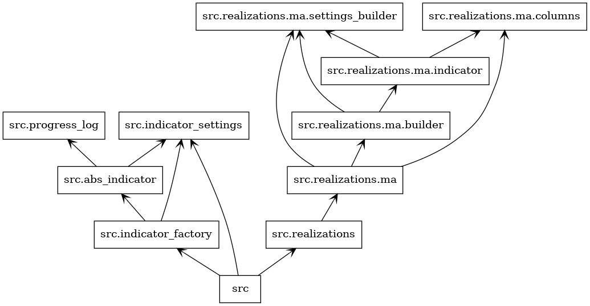
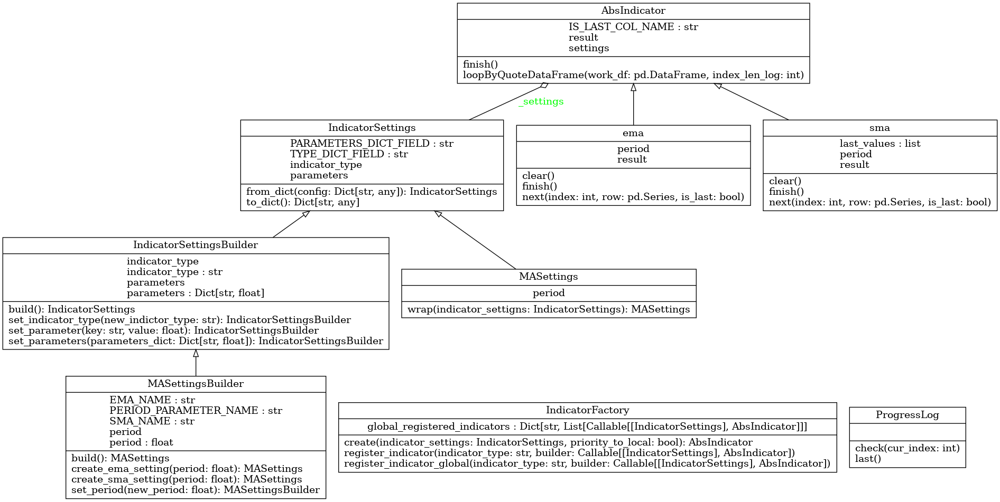

# IndicatorFactory
Base repository for indicator.
## Architecture
- Created by
```sh
pyreverse -o png -p src src
```





## Base classes
### IndicatorFactory
Create instance of indicator
#### Import
```python
from . import IndicatorFactory 
```

#### Register indicators
- Global
```python
def get_indicator(settings: IndicatorSettings) -> AbsIndicator:
  ...

IndicatorFactory.register_indicator_global("IndicatorUniqueName", get_indicator)
```

- Local (for factory instance)
```python
def get_indicator(settings: IndicatorSettings) -> AbsIndicator:
  ...

IndicatorFactory().register_indicator("IndicatorUniqueName", get_indicator)
```

#### Get instance of indicator
```python
from . import IndicatorSettingsBuilder
indicator_settings_builder = IndicatorSettingsBuilder()
...
indicator_settings = indicator_settings_builder.build()

IndicatorFactory().create(indicator_settings)
```

### AbsIndicator
Abstraction for indicator
#### Create new indicator
1. Create new indicator
view example on src.indicators.ma.indicator
2. Create builder function
view example on src.indicators.ma.builder
3. Optionaly create Setting Builder wrapper
view example on src.indicators.ma.settings_builder